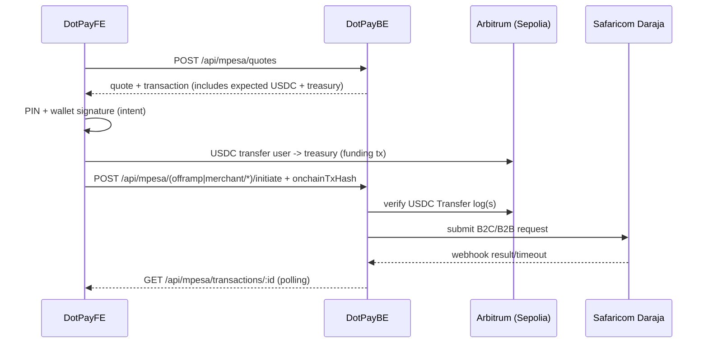

# DotPay Backend (DotPayBE)

Express + MongoDB backend that acts as the **system of record** for:

- User identity (`/api/users`, DotPay ID provisioning)
- Notifications (`/api/notifications/*`)
- M-Pesa (Safaricom Daraja) quotes, transactions, and callbacks (`/api/mpesa/*`)
- Crypto ↔ M-Pesa settlement verification (USDC funding on Arbitrum Sepolia in sandbox)

## Architecture (M-Pesa + Crypto-Funded Flows)



Notes:

- For `offramp`, `paybill`, and `buygoods` we support **user-push funding** (frontend sends the USDC on-chain; backend verifies).
- `onramp` (STK Push top up) currently tracks the M-Pesa leg only; wallet crediting is a separate step to implement.

## Requirements

- Node.js >= 18
- MongoDB (Atlas URI)
- Daraja credentials (sandbox or production)
- If `MPESA_REQUIRE_ONCHAIN_FUNDING=true`:
  - Arbitrum RPC (`TREASURY_RPC_URL`)
  - USDC contract address (`TREASURY_USDC_CONTRACT`)
  - Treasury address (`TREASURY_PLATFORM_ADDRESS`) or a private key (`TREASURY_PRIVATE_KEY`)

## Setup

```bash
cd /Users/Shared/odero/DotPay/DotPayBE
npm install
cp .env.example .env
```

Fill `.env` (do not commit it).

## Run (Local)

If you are testing M-Pesa locally, you must expose the backend over **public HTTPS** so Safaricom can reach your
webhooks. The tunnel script will update callback env vars and can optionally restart the backend for you.

```bash
npm run dev
```

Server: `http://localhost:4000` (or your `PORT`).

### Local Callback Tunnel (No ngrok token)

Safaricom callbacks require **public HTTPS**. For local dev, use:

```bash
cd /Users/Shared/odero/DotPay/DotPayBE
./scripts/start-local-tunnel.sh
```

Defaults:

- Provider: `cloudflared` quick tunnel (no login required)
- Updates `.env`: `MPESA_RESULT_BASE_URL`, `MPESA_TIMEOUT_BASE_URL`
- Restarts backend in a `screen` session by default

If you already have `npm run dev` running in your terminal, disable the auto-restart:

```bash
RESTART_BACKEND=false ./scripts/start-local-tunnel.sh
```

Optional providers:

```bash
TUNNEL_PROVIDER=pinggy ./scripts/start-local-tunnel.sh
TUNNEL_PROVIDER=localhostrun ./scripts/start-local-tunnel.sh
```

Stop:

```bash
./scripts/stop-local-tunnel.sh
```

## Environment Variables

See `DotPayBE/.env.example` for the full list. Key groups:

- Mongo + HTTP
  - `MONGODB_URI` (required)
  - `PORT` (default `4000`)
  - `CLIENT_ORIGINS` (CORS allowlist in production)
- DotPay internal auth
  - `DOTPAY_INTERNAL_API_KEY` (required for internal-only endpoints)
  - `DOTPAY_BACKEND_JWT_SECRET` (required; verifies frontend-minted bearer tokens for `/api/mpesa/*`)
- Daraja
  - `MPESA_ENABLED` (`true` to enable all Daraja routes)
  - `MPESA_ENV` (`sandbox` or `production`)
  - `MPESA_CONSUMER_KEY`, `MPESA_CONSUMER_SECRET`
  - `MPESA_SHORTCODE`, `MPESA_PASSKEY`
  - `MPESA_INITIATOR_NAME`, `MPESA_SECURITY_CREDENTIAL` (or `MPESA_INITIATOR_PASSWORD` + `MPESA_CERT_PATH`)
  - `MPESA_RESULT_BASE_URL`, `MPESA_TIMEOUT_BASE_URL` (must be public HTTPS)
  - Optional: `MPESA_WEBHOOK_SECRET` (adds an extra shared secret to webhook auth)
- Settlement (crypto-funded flows)
  - `MPESA_REQUIRE_ONCHAIN_FUNDING` (default `true` in this project)
  - `MPESA_MIN_FUNDING_CONFIRMATIONS` (default `1`)
  - `TREASURY_RPC_URL`, `TREASURY_CHAIN_ID`
  - `TREASURY_USDC_CONTRACT`, `TREASURY_USDC_DECIMALS`
  - `TREASURY_PLATFORM_ADDRESS` (preferred) or `TREASURY_PRIVATE_KEY` (needed for refunds)
  - `TREASURY_REFUND_ENABLED` (set `false` to disable refunds)

## Authentication Model

- User-initiated `/api/mpesa/*` endpoints require:
  - `Authorization: Bearer <token>`
  - Token must be signed with `DOTPAY_BACKEND_JWT_SECRET`
  - Token scope must include `mpesa` (enforced by middleware)
- Internal endpoints (e.g. reconcile) use `DOTPAY_INTERNAL_API_KEY`.

## API Summary

### Health

- `GET /health`
- `GET /api/health` (useful for serverless deployments)

### Users

- `POST /api/users`
- `GET /api/users/:address`
- `PATCH /api/users/:address/identity`
- `GET /api/users/:address/pin` (auth required, self only)
- `PATCH /api/users/:address/pin` (auth required, self only; sets/updates 6-digit PIN)

### M-Pesa (Daraja)

- Quotes
  - `POST /api/mpesa/quotes`
- Onramp (STK Push)
  - `POST /api/mpesa/onramp/stk/initiate`
  - Webhook: `POST /api/mpesa/webhooks/stk`
- Offramp (B2C)
  - `POST /api/mpesa/offramp/initiate`
  - Webhooks: `POST /api/mpesa/webhooks/b2c/result`, `POST /api/mpesa/webhooks/b2c/timeout`
- Merchant pay (B2B)
  - `POST /api/mpesa/merchant/paybill/initiate`
  - `POST /api/mpesa/merchant/buygoods/initiate`
  - Webhooks: `POST /api/mpesa/webhooks/b2b/result`, `POST /api/mpesa/webhooks/b2b/timeout`
- Transactions
  - `GET /api/mpesa/transactions/:id`
  - `GET /api/mpesa/transactions`
- Operations
  - `POST /api/mpesa/internal/reconcile` (internal key)

## Transaction State Machine

Stored in `MpesaTransaction.status`:

- `created`
- `quoted`
- `awaiting_user_authorization`
- `awaiting_onchain_funding`
- `mpesa_submitted`
- `mpesa_processing`
- `succeeded`
- `failed`
- `refund_pending`
- `refunded`

## Sandbox Test Values (Common)

Safaricom sandbox commonly uses:

- Test phone: `254708374149`
- STK Push BusinessShortCode: `174379`
- PayBill receiver: `600000`
- BuyGoods till: `300584`
- Initiator: `testapi` (password typically `Safaricom123!!` in sandbox)

## Troubleshooting

- `mpesa_processing` never finishes
  - Safaricom cannot reach your webhook URLs. Fix `MPESA_RESULT_BASE_URL` and `MPESA_TIMEOUT_BASE_URL` (public HTTPS), then retry.
- Funding verification fails
  - Check chain ID, USDC contract, treasury address, and that the tx contains a `Transfer(from=user,to=treasury,value>=expected)`.
- B2B “receipt” missing
  - B2B callbacks may not include a receipt field; backend will store conversation IDs and the result code/desc.

## Deploy

### Vercel (Serverless)

This repo supports Vercel serverless via `api/index.js` (Express handler).

Required env vars:

- `MONGODB_URI`
- `DOTPAY_INTERNAL_API_KEY`
- `DOTPAY_BACKEND_JWT_SECRET`

Recommended:

- `CLIENT_ORIGINS` (lock down CORS)
- All `MPESA_*` keys (when enabling Daraja)
- Settlement keys when `MPESA_REQUIRE_ONCHAIN_FUNDING=true`

Notes:

- `/health` is rewritten to `/api/health` via `vercel.json`.
- For production, prefer a stable domain for callbacks (do not rely on tunnels).

### VPS / VM

Running on a VPS with a stable public domain + HTTPS is the simplest way to avoid local tunnel callback issues.
